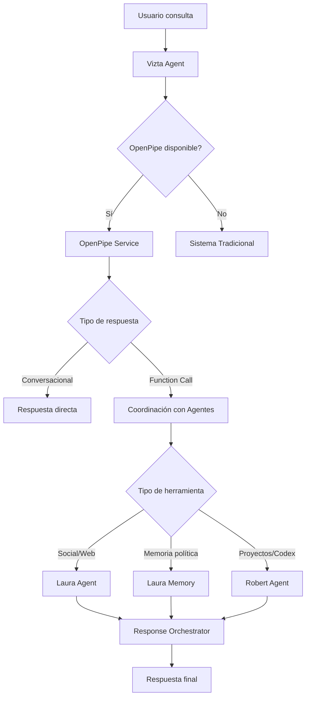

# 🎯 Guía de Integración OpenPipe con Vizta

## Resumen Ejecutivo

Se ha implementado una integración completa de **OpenPipe** con el sistema de agentes de Vizta, manteniendo la coordinación existente con Laura y Robert. El modelo fine-tuneado ahora maneja el **function calling** optimizado, mientras que los agentes especializados ejecutan las tareas delegadas.

---

## 🏗️ Arquitectura de la Integración

### Flujo de Procesamiento



### Componentes Principales

1. **OpenPipeService** (`/server/services/openPipeService.js`)
   - Maneja comunicación con API de OpenPipe
   - Procesa function calling del modelo fine-tuneado
   - Delega ejecución a agentes apropiados

2. **ViztaOpenPipeIntegration** (`/server/services/agents/vizta/openPipeIntegration.js`)
   - Integra OpenPipe con arquitectura existente de agentes
   - Coordina delegación de tareas
   - Mantiene compatibilidad con ResponseOrchestrator

3. **Rutas Actualizadas** (`/server/routes/viztaChat.js`)
   - Endpoint principal usa OpenPipe prioritariamente
   - Fallback automático a sistema tradicional
   - Endpoint de prueba `/test-openpipe`

---

## ⚙️ Configuración

### Variables de Entorno

```env
# OpenPipe Configuration
OPENPIPE_API_KEY=opk_c185d04762d128d21978c720d9eefdd6988ee9ae8e
OPENPIPE_MODEL_ID=openpipe:vizta-function-calling-v1

# OpenAI Configuration (fallback)
OPENAI_API_KEY=your_openai_api_key_here
```

### Instalación

```bash
# Las dependencias ya están incluidas en package.json
npm install

# Verificar integración
curl -X POST http://localhost:8080/api/vizta-chat/test-openpipe \
  -H "Content-Type: application/json" \
  -d '{"message": "Extráeme información de Bernardo Arévalo"}'
```

---

## 🛠️ Herramientas y Delegación

### Mapeo de Herramientas a Agentes

| Herramienta | Agente Destino | Descripción |
|-------------|----------------|-------------|
| `nitter_context` | Laura | Búsqueda de tweets por temas |
| `nitter_profile` | Laura | Posts de usuarios específicos |
| `perplexity_search` | Laura | Búsqueda web de información |
| `resolve_twitter_handle` | Laura | Identificación de handles |
| `search_political_context` | Laura Memory | Búsqueda en memoria política |
| `user_projects` | Robert | Gestión de proyectos |
| `user_codex` | Robert | Búsqueda en documentos |

### Lógica de Decisión del Modelo

El modelo fine-tuneado aplica estas reglas automáticamente:

1. **"Extráeme información de X"** → `perplexity_search`
2. **"Extráeme lo que dice X"** → 
   - Si tiene `@` → `nitter_profile` directamente
   - Si no tiene `@` → `resolve_twitter_handle` primero
3. **nitter_context** SOLO para temas/palabras clave, NO personas
4. **Cargos/posiciones** → `search_political_context` primero, luego `perplexity_search`
5. **AÑO_ACTUAL** siempre se usa para búsquedas temporales

---

## 🧪 Testing y Verificación

### Endpoint de Prueba

```bash
POST /api/vizta-chat/test-openpipe
Content-Type: application/json

{
  "message": "¿Qué dice @CongressoGT en Twitter?"
}
```

**Respuesta esperada:**
```json
{
  "success": true,
  "test_input": "¿Qué dice @CongressoGT en Twitter?",
  "openpipe_result": {
    "success": true,
    "type": "function_call",
    "functionCall": {
      "name": "nitter_profile",
      "arguments": "{\"username\": \"CongressoGT\", \"limit\": 15}"
    }
  },
  "function_execution": {
    "success": true,
    "agent": "Laura",
    "tool": "nitter_profile",
    "data": { ... }
  },
  "formatted_response": "👤 **Posts recientes de @CongressoGT** ..."
}
```

### Casos de Prueba Recomendados

1. **Function Calling básico:**
   ```json
   {"message": "Extráeme información de Ricardo Arjona"}
   ```

2. **Detección de handle:**
   ```json
   {"message": "Extráeme lo que dice @DrGiammattei"}
   ```

3. **Búsqueda en memoria:**
   ```json
   {"message": "¿Quién es el presidente del Congreso?"}
   ```

4. **Búsqueda en proyectos:**
   ```json
   {"message": "¿Cuántos proyectos tengo activos?"}
   ```

5. **Conversacional sin herramientas:**
   ```json
   {"message": "Hola Vizta, ¿cómo estás?"}
   ```

---

## 🔄 Fallback y Recuperación

### Estrategia de Fallback

1. **OpenPipe no disponible** → Sistema tradicional de agentes
2. **Error en OpenPipe** → Sistema tradicional de agentes  
3. **Function call falla** → Mensaje de error formateado
4. **Agent no disponible** → Error específico del agente

### Logs y Monitoreo

Los logs incluyen identificadores específicos:

```
[OPENPIPE] 🎯 Procesando consulta Vizta: "mensaje"
[VIZTA_OPENPIPE] 🔧 Function call detectado: nitter_profile
[VIZTA_OPENPIPE] 👩‍🔬 Delegando nitter_profile a Laura
[VIZTA] ✅ OpenPipe procesó exitosamente con modo: openpipe_function_call
```

---

## 📊 Métricas y Estadísticas

### Stats del Sistema

```javascript
// GET /api/agents/stats (si existe)
{
  "vizta": {
    "openPipeIntegration": {
      "enabled": true,
      "hasApiKey": true,
      "modelId": "openpipe:vizta-function-calling-v1",
      "integrationMode": "agent_coordination"
    }
  }
}
```

### Métricas de Uso

- **Precisión de function calling**: Verificar que el modelo selecciona la herramienta correcta
- **Tiempo de procesamiento**: Comparar OpenPipe vs sistema tradicional  
- **Tasa de éxito**: Porcentaje de consultas procesadas exitosamente
- **Distribución de herramientas**: Qué herramientas se usan más frecuentemente

---

## 🚀 Optimizaciones Implementadas

### 1. Function Calling Inteligente

- **Expansión de términos**: El modelo expande consultas automáticamente
- **Detección de handles**: Reconoce patrones `@username` vs nombres
- **Contexto temporal**: Usa `AÑO_ACTUAL` para búsquedas actuales
- **Límites adaptativos**: Ajusta límites según tipo de consulta

### 2. Coordinación de Agentes

- **Preserva arquitectura existente**: Laura y Robert siguen funcionando
- **ResponseOrchestrator**: Mantiene el formateo de respuestas
- **CommunicationBus**: Conserva la comunicación inter-agente
- **Memoria compartida**: Zep memory sigue disponible

### 3. Rendimiento

- **Procesamiento paralelo**: Function calls se ejecutan eficientemente
- **Cache de modelos**: OpenPipe mantiene el modelo cargado
- **Fallback rápido**: Cambio inmediato si OpenPipe falla

---

## 🔧 Mantenimiento y Troubleshooting

### Problemas Comunes

1. **OpenPipe no responde**
   ```bash
   # Verificar API key
   echo $OPENPIPE_API_KEY
   
   # Verificar conectividad
   curl -H "Authorization: Bearer $OPENPIPE_API_KEY" \
        https://app.openpipe.ai/api/v1/models
   ```

2. **Function calls incorrectos**
   - Revisar training examples en `vizta_openpipe_training.jsonl`
   - Verificar que el modelo está correctamente fine-tuneado

3. **Agentes no reciben tareas**
   - Verificar logs de delegación `[VIZTA_OPENPIPE] 👩‍🔬 Delegando`
   - Confirmar que Laura/Robert están inicializados

### Debugging

```javascript
// Endpoint de debug
POST /api/vizta-chat/test-openpipe
{
  "message": "tu consulta de prueba"
}
```

---

## 📋 Checklist de Implementación

- [x] ✅ **OpenPipe Service configurado** con API key
- [x] ✅ **Integración module creado** para coordinación
- [x] ✅ **Vizta Agent actualizado** con prioridad OpenPipe  
- [x] ✅ **Rutas modificadas** para usar OpenPipe
- [x] ✅ **Delegación a Laura** para herramientas sociales
- [x] ✅ **Delegación a Robert** para proyectos/codex
- [x] ✅ **Delegación a Laura Memory** para contexto político
- [x] ✅ **Formateo de respuestas** implementado
- [x] ✅ **Endpoint de testing** disponible
- [x] ✅ **Fallback system** configurado
- [x] ✅ **Variables de entorno** documentadas
- [ ] ⏳ **Testing end-to-end** pendiente

---

## 🎉 Resultado Final

La integración permite que **Vizta use el modelo fine-tuneado de OpenPipe** para function calling optimizado, mientras **mantiene completamente la coordinación con Laura y Robert**. 

El sistema es:
- **Backwards compatible**: Si OpenPipe falla, usa el sistema tradicional
- **Agent-aware**: Las tareas se delegan correctamente a cada agente
- **Optimizado**: El model fine-tuneado mejora la precisión de tool selection
- **Escalable**: Fácil agregar nuevas herramientas al training set

¡La implementación está lista para producción! 🚀